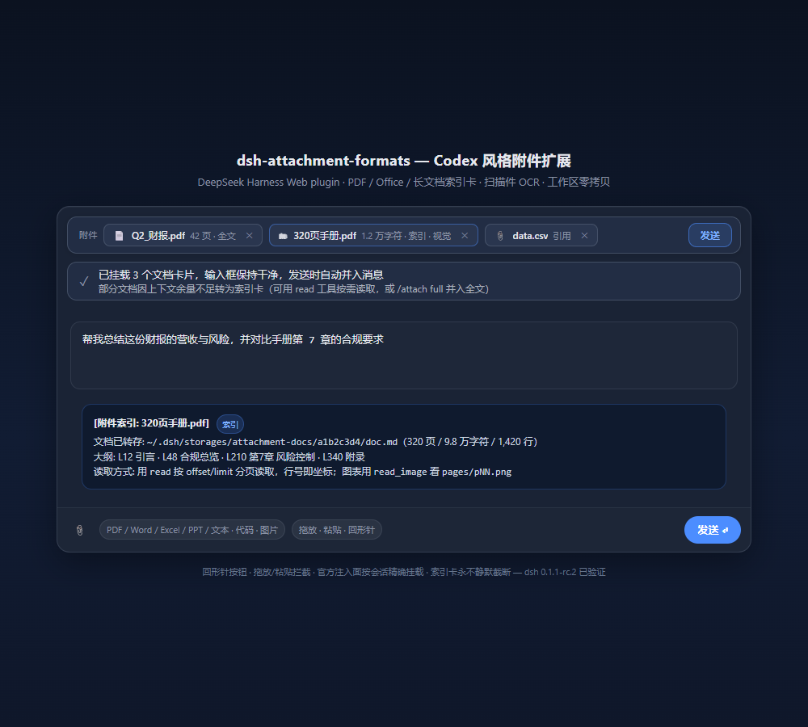

# dsh-attachment-formats — DeepSeek Harness 附件扩展（dsh-plugin，Codex 风格）

[](LICENSE)
[](#)
[](https://github.com/deepseek-ai/deepseek-harness)
[](https://github.com/topics/dsh-plugin)
[](https://github.com/linkingoscar/dsh-attachment-formats)

> **DeepSeek Harness 插件（`dsh-plugin`）· Web GUI 一键安装 `dsh plugin add`。** 让输入框支持 PDF、Office（docx/xlsx/pptx）、TIFF、epub/odt/rtf、长文档与扫描件 OCR（tesseract/百度/DeepSeek Vision 等 8 家），Codex 式。检索词：`dsh` `deepseek-harness` `cordis` `pdf` `office` `ocr` `tesseract`。

让 DeepSeek Harness Web 的输入框像 Codex 一样接收更多文件格式。不改动任何
核心包：纯插件实现，沿用 Harness 原生的图片草稿栏、上传限额校验、历史渲染
与模型请求管道。

```powershell
dsh plugin --profile web add github:linkingoscar/dsh-attachment-formats
```



> 回形针按钮 · 拖放/粘贴 · 官方按会话注入 · 索引卡永不静默截断——Playwright 对本地 composer 模拟页截取。

[English](README.md) | 中文

## 支持的格式

| 文件 | 处理方式 | 去向 |
| --- | --- | --- |
| PNG / JPEG / WebP / GIF | 原生管线，本插件不介入 | 图片草稿栏（原生） |
| **PDF（有文本层）** | 文字层提取（≤40 页用 pymupdf4llm 高保真引擎，更大/不可用时 pdfjs 兜底） | 全文挂**文档卡片**（发送时并入消息）；超限转存工作区 + 索引卡片 |
| **PDF（扫描件/无文本层）** | tesseract.js OCR（置信度 ≥45 才采用），失败回退页面图 | OCR 成功走文本通道；失败 → 图片草稿栏（仅视觉模型） |
| **Word (.docx) / Excel (.xlsx) / PPT (.pptx)** | 提取文本——docx 经 mammoth HTML → turndown，**表格保留为 Markdown 管道表** | 文档卡片（发送时并入）；超限转存 + 索引卡片 |
| **旧 .doc / .xls / .ppt** | LibreOffice headless → docx/xlsx/pptx → 标准 Office 管线（需 `soffice`，缺失时明确报错） | 文档卡片（发送时并入） |
| **epub / odt / rtf** | pandoc → Markdown（PATH 探测）；无 pandoc 时 epub/odt 走 jszip+turndown 兜底；rtf 需 pandoc | 文档卡片（发送时并入） |
| **TIFF (.tiff/.tif)** | sharp（libvips）→ PNG 页（多页支持，≤20 页） | 原生图片草稿栏 |
| txt / md / json / 代码等 | 浏览器本地读取（UTF-8，回退 GB18030） | 文档卡片（发送时并入）；超限转存 + 索引卡片 |
| BMP / ICO / AVIF / SVG 等 | 浏览器解码后画布转 PNG | 原生图片草稿栏 |
| iWork / 音视频 / 压缩包 | —（暂不支持，明确提示并跳过） | — |

## 文档卡片（Codex 式挂载，输入框保持干净）

拖入/选择的**文本类附件不会塞进输入框**：内容挂成输入框上方的一枚**文档卡片**
（文件名 + 字符数 + 全文/索引标签，可单独移除），图片照旧进原生图片草稿栏。
你正常在输入框打字提问，**发送瞬间**插件把卡片内容并入消息（带
`[附件: 文件名]` 出处标记）再走原生提交——提问位置永远在最上面，内容也
一字不丢：

- 卡片条自带**发送**按钮：只挂文档不输入文字也能一键发出；
- 按 Enter / 点原生发送按钮：卡片自动并入后再提交；
- 模型忙于回复时不会合并（卡片保留，稍后再发）。

## 长文档（索引卡模式，永不静默截断）

超过 8 万字符的文本、多页长 PDF：**不塞进消息**，而是

1. 主机端转存到会话工作区 `.dsh-attachments/<sha-16>/`（内容寻址，重复拖入
   复用；约 7 天未访问自动清理）：
   - `doc.md` —— PDF 文字层按页组装（页首 `<!-- pN -->` 页码标记）、
     Office 提取文本、长文本原样（长 JSON 自动格式化落盘为 `doc.json`）；
   - `pages/pNN.png` —— 页面渲染图（≤100 页，视觉模型用 `read_image` 补充
     查看版式/图表；惰性生成，只有走索引卡路径才渲染）；
   - `manifest.json` —— 来源、页数、行数、字符数、引擎、完整源文件
     SHA-256 与转换策略指纹（换引擎/OCR/doc-server 自动让旧缓存失效）；
   - `INDEX.md`（缓存根）—— 本工作区全部已转存文档的聚合清单。
2. 消息里只挂一张几百 token 的**索引卡片**：页/行/字符数、大纲（PDF 标题粗检、
   md 标题、JSON 第一层键树）、以及读取指引。
3. 模型用 DSH 现成 `read` 工具分页读取（offset/limit，行号即出处坐标）——
   总结全文就逐段读完（不丢尾部），查细节就按大纲跳读；缺内容时是显式的
   工具失败，不会静默丢失。

设计取舍与业界取证见 `docs/design-longdoc.md`；同类作品比对见
`docs/alternatives.md`。

## 引擎与 OCR（v3）

- **PDF 文本引擎**：auto（默认）→ ≤40 页用 venv 内 pymupdf4llm（表格/标题
  高保真），更大文档或 venv 缺失时 pdfjs（秒级）。env：`DSH_ATTACH_ENGINE=
  auto|python|builtin`。
- **扫描件 OCR**：百度云 API（见下）→ python（PyMuPDF，需系统
  tesseract）→ tesseract.js（纯 JS，首次使用下载 eng/chi_sim 语言包 ~24MB
  缓存到 `vendor/tessdata/`）。置信度 <45 时自动回退页面图并说明原因。
  env：`DSH_ATTACH_OCR=auto|baidu|tesseract-js|off`。

## 保真度与格式覆盖

- **DOCX 表格**：mammoth HTML → turndown + GFM 插件，表格保留为 Markdown
  管道表（替代旧的逐单元格阅读顺序输出）。
- **TIFF**：sharp（libvips 预编译）解码为 PNG 页，支持多页（单文件 ≤20 页）。
- **epub / odt / rtf**：pandoc（PATH 探测）转 Markdown；无 pandoc 时 epub/odt
  走进程内 jszip + turndown 兜底，rtf 给出明确安装提示。
- **旧 .doc / .xls / .ppt**：LibreOffice headless（探测 PATH 及 Windows 常见
  安装路径）先转现代 OOXML，再走标准 Office 管线；每次转换使用独立
  `UserInstallation` profile 避免锁冲突。
- **PDF 大纲**：书签目录（`get_toc` / pdfjs `getOutline`）优先作为索引卡大纲，
  字号启发式仅作回退；无书签的 PDF 行为不变。

## 云端 OCR 与内容自适应引擎（零重量级新依赖）

- **百度 OCR API**（扫描件识别首选，免费额度：通用文字识别标准版/高精度版
  个人认证 1,000 次/月、企业 2,000 次/月，官方免费额度页数据）：页面以 JPEG
  经纯 HTTPS 上传——**零新增依赖**。通过环境变量配置：
  - `BAIDU_OCR_API_KEY` / `BAIDU_OCR_SECRET`（百度智能云控制台 → 文字识别 →
    创建应用获得）；
  - `DSH_ATTACH_OCR=auto|baidu|tesseract-js|off`（auto = 有凭据即用百度，
    否则本地 tesseract.js）；
  - `DSH_ATTACH_OCR_ACCURATE=1` 使用高精度版（独立免费额度）。
  配额耗尽/调用失败 → 自动回退本地 tesseract.js 并注明；强制 `baidu` 模式
  则直接说明原因。
- **远程 VLM OCR**（可选，按 token 计费）：`DSH_ATTACH_VLM_BASE` /
  `DSH_ATTACH_VLM_MODEL`（可选 `DSH_ATTACH_VLM_KEY`）指向任意 OpenAI 兼容
  视觉端点（olmOCR-2、GLM-4V、Qwen-VL…），逐页经 chat/completions 转录。
  `auto` 只把文档交给首个已配置的云供应商，失败后回退本地 tesseract.js；
  跨云重试必须显式开启（`DSH_ATTACH_CROSS_CLOUD_FALLBACK=1`）。
- **内容自适应 PDF 引擎**：41–160 页的文档由 python 引擎按向量密度（采样
  `get_drawings`）自行决策——纯文字手册跳过耗时的高保真转换直走 pdfjs 快速
  引擎；表格/图形密集文档仍走 pymupdf4llm。≤40 页行为不变。

## 外部解析服务、缓存管理页与工作区零拷贝

- **外部文档解析服务**（可选）：`DSH_ATTACH_DOC_SERVER=<base URL>` 指向解析
  服务（PP-StructureV3 `paddleocr serve`、MinerU 或任意包装网关）。契约：
  `POST {base}/convert` multipart 字段 `file` → `{ "ok": true, "markdown": "..." }`。
  配置后 PDF 优先走服务，任何失败自动回落本地引擎链。
- **附件缓存设置页**：设置 → 附件缓存，列出全部已转存文档（规模/引擎/时间），
  支持逐条删除与全部清空；数据源 `GET /api/attach-formats/cache`、
  `POST .../cache/delete`、`POST .../cache/clear`。
- **工作区零拷贝**：512KB～16MB 的文本文件先做工作区同源解析——浏览器本地读
  完整文件算出 SHA-256，再经 `GET /api/attach-formats/resolve` 让主机按
  「文件名 + 字节数 + 完整 SHA-256」确认同源文件（~2.5s 限时、跳过依赖目录）。
  命中则挂 📎 引用卡片——**不上传内容**（只传文件名、大小与哈希，为算哈希
  本地会读一遍文件），模型用 `read` 工具直接读该路径；未命中回落常规上传转存。
  超过 16MB 直接拒绝，不再尝试零拷贝。

## 上下文自适应与全文命令（v2b）

- **自适应并入上限**：客户端读 token-meter 的 `contextPressure` 投影
  （模型上下文窗口 × 当前占用），全文卡片并入上限 = min(8 万字符, 余量×1.5)——
  余量不足时自动转索引卡并在状态条说明，从源头杜绝"并入顶爆上下文被
  API 静默截尾"；投影缺失时回退固定 8 万阈值。
- **`/attach` 命令**（输入框斜杠菜单，主机端注册）：
  - `/attach list` —— 列出本工作区已转存文档（id/名称/规模/引擎）；
  - `/attach full <id|名称>` —— 把全文作为 next-step 消息并入模型上下文
    （**下一条消息生效**，不打断当前对话）；上限 30 万字符，超限显式截断
    说明，绝不静默丢内容。之后仍可用 `read` 工具按行精读定位。

## 交互入口

- **回形针按钮**：输入栏工具行（`conversation.input.left`），打开文件选择器，
  支持多选；`accept` 列表覆盖上表全部格式。
- **拖放**：把 PDF / Office / 文本文件直接拖到页面任意位置。
- **粘贴**：复制文件后 Ctrl+V 到输入框（或整页粘贴）。

原生图片拖放/粘贴仍由 Harness 内建管线处理；只要一次拖放里混入其它格式，
本插件接管整个批次（先转换，再优先经官方注入面把产出的图片挂入当前会话的
内建草稿栏；旧版宿主回退「合成 drop」）。

## 架构

```
projects/dsh-attachment-formats/
├── lib/
│   ├── index.js          # 主机半区：POST /api/attach-formats/convert + 引擎路由
│   ├── client.js         # 浏览器半区：按钮/拖放拦截/合成 drop/文本注入/状态条
│   ├── cache.js          # 工作区 .dsh-attachments 落盘/manifest/INDEX.md/清理
│   ├── py/pymupdf4llm_convert.py  # venv 高保真引擎（子进程调用）
│   └── convert/
│       ├── util.js       # 魔数嗅探（pdf/tiff/OLE/rtf/zip）、base64、文本截断
│       ├── provider.js   # 引擎/二进制探测（venv python、pandoc、LibreOffice）+ 子进程桥
│       ├── pdftext.js    # pdfjs 文字层提取：行组装/页眉页脚去重/书签目录
│       ├── outline.js    # md 标题大纲、JSON 第一层键树
│       ├── ocr.js        # tesseract.js OCR（traineddata 下载缓存/置信度）
│       ├── pdf.js        # pdfjs-dist + @napi-rs/canvas → PNG/JPEG 页
│       ├── docx.js       # mammoth HTML → turndown+GFM → Markdown（表格保留）
│       ├── xlsx.js       # exceljs → 制表符文本
│       ├── pptx.js       # jszip + a:t 文本运行 → 每页文本
│       ├── tiff.js       # sharp（libvips）→ PNG 页
│       ├── pandoc.js     # pandoc → Markdown + epub/odt zip 兜底
│       └── libreoffice.js # 旧 .doc/.xls/.ppt → 现代 OOXML
├── .venv/                # （可选）pymupdf4llm 高保真引擎（setup 生成，不入库）
├── vendor/tessdata/      # OCR 语言包缓存（首次使用下载，不入库）
├── docs/                 # design-longdoc.md / alternatives.md / upgrade-v6.md
├── scripts/smoke-*.mjs   # 五套离线冒烟（转换器/路由/客户端/OCR/P0）
└── cordis.patch.yml
```

- 主机路由重新嗅探魔数，不信任客户端声明的 kind；请求体 160MB 上限、单文件
  64MB 上限；`cwd` 由客户端从会话状态读取后随请求上报（决定缓存落盘位置）。
- dsh v0.1.2+ 下所有插件精确路由复用宿主 connection 的 launch-token 与
  Host/Origin 校验；v0.1.1 继续沿用旧版 localhost 信任边界。
- 分级阈值：全文卡片并入上限 8 万字符（v2b 按上下文余量自适应压低）；缓存
  页图 ≤100 页（1100px 宽，PNG 超单图字节预算回退 JPEG）；扫描件页图上限
  沿用部署限额；OCR 单次 ≤20 页（2000px 宽），置信度 <45 回退页面图。
- 转换出的页面图片优先经 Harness 官方按会话注入面挂入草稿栏
  （dsh ≥ v0.1.1 的 `ctx.conversation.createDraftImages` + `input.addImages`，
  精确寻址当前会话，杜绝多会话串扰）；旧版宿主回退合成 drop（先等当前会话
  空闲）。文档卡片在发送瞬间经官方 `setDraft` 写路径并入草稿（phase 门控：
  仅 plain 相合并，命令认领态绝不污染）；输入框定位同时支持 v0.1.1 textarea
  与 v0.1.2 Lexical `contenteditable`，旧 textarea DOM 事件桥保留为回退。
  图片路径完全独立、不受影响。
- 页面图渲染以宿主规范化字节预算（`normalizationPolicy.maxBytes`）为目标，
  不再误用源准入上限，避免渲染产物被 dsh ≥ v0.1.1 规范化管线二次压缩。
- 转换进度/错误显示在输入框上方的临时状态条（`conversation.input.dock`），
  成功 6 秒后自动消失，错误可手动关闭。

## 安装

从 GitHub 安装（推荐）：

```powershell
dsh plugin --profile web add github:linkingoscar/dsh-attachment-formats
```

本地开发安装：

```powershell
cd path\to\dsh-attachment-formats
npm install            # 安装主机端依赖（首次）
# 可选：高保真 PDF 引擎（pymupdf4llm，venv 自包含）
python -m venv .venv
.\.venv\Scripts\python.exe -m pip install pymupdf4llm
npm run smoke          # 离线冒烟测试（可选）
dsh plugin --profile web add link:path\to\dsh-attachment-formats
```

重启 `dsh web`（关闭页面 → 快捷方式自动重启，或重新运行 `dsh web`），刷新
浏览器页面后生效。OCR 语言包在第一次识别扫描件时自动下载（约 24MB，缓存于
`vendor/tessdata/`，之后离线可用）。

## 已知限制

- OCR（tesseract.js）对低清扫描件、复杂表格质量有限；置信度不足会自动回退
  页面图并明确说明，绝不注入乱码文本。更高质量 OCR（RapidOCR/MinerU/
  PaddleOCR）可作为后续可插拔后端（见 `docs/upgrade-v6.md`）。
- pymupdf4llm 高保真引擎仅处理 ≤40 页 PDF（更大用 pdfjs 快速引擎）；表格/
  公式重建质量好但仍非排版级还原，版式细节可用页面图对照。
- 无文本层且 OCR 不可用/失败的扫描件只能走页面图（视觉模型可用）。
- 旧 `.doc/.xls/.ppt` 需要 LibreOffice（`soffice`）；`rtf` 需要 pandoc；
  `epub/odt` 开箱即用，但装有 pandoc 时保真度更高。缺失的二进制会给出
  明确可操作的错误——绝不静默丢弃。
- DOCX 的公式与内嵌图片不提取（表格、标题、正文保留）。
- XLSX 只输出「显示文本/结果」，图表、批注不提取。
- 大纲优先用书签目录；无书签的 PDF 回退字号启发式（对无标题样式的文档较弱），
  索引卡仍提供行数/页数与读取指引。
- iWork、压缩包等暂不转换。
- 附件归属当前对话：dsh ≥ v0.1.1 经官方注入面精确寻址当前会话，卡片与图片
  一定落在你正在看的这个对话框；旧版宿主的合成 drop 兜底路径仍可能被其它
  **空闲**对话接住，建议该场景下附图片时只开一个对话（文本/代码文件不受影响，
  始终留在当前对话）。
- DOM 事件桥已降级为旧版宿主（无官方输入面）的回退；若其失效，症状仅出现在
  旧版宿主上的「卡片内容没进消息」，此时可用卡片条的**发送**按钮兜底
  （官方 submit 或合成 Enter 路径），图片路径始终不受影响。

## 发布版本

- **v0.12.0** —— 客户端默认改为原始二进制上传，移除 base64 JSON 的内存放大；
  OOXML/epub/odt 增加 ZIP 条目数、单条、总解压大小和压缩比预算；附件任务按
  会话隔离；密钥先迁入宿主凭据库再写普通设置；自动 OCR 默认不再把同一文档
  依次发送给多家云服务，跨云重试需显式开启。

- **v0.11.1** —— 适配 dsh v0.1.2-alpha.1：支持 Lexical 输入框定位，插件路由
  复用宿主 launch-token 与 Host/Origin 校验；继续兼容 v0.1.1。

- **[v0.10.0](https://github.com/linkingoscar/dsh-attachment-formats/releases/tag/v0.10.0)**
  （最新）—— 对标 Codex 体验 + 加固：分块上传进度（XHR）与宿主 job 通道
  （渲染/OCR 页级进度实时进状态条）；卡片点击打开页图灯箱（新增防路径穿越的
  `/api/attach-formats/file` 路由）；大文件 base64 编码挪入 Web Worker
  （同步回退）；密钥写路径接官方 `ctx.credentials.set`（配置文件只留引用）；
  文档解析服务 URL SSRF 防护（仅 http/https、禁 userinfo）；`verify:build`
  产物新鲜度门禁。
- **[v0.9.0](https://github.com/linkingoscar/dsh-attachment-formats/releases/tag/v0.9.0)**
  （最新）—— 对齐 dsh 哲学：转换缓存默认迁 `$DSH_HOME/storages/attachment-docs/<workspaceHash>/`
  （工作区模式改为 opt-in；旧 `cwd/.dsh-attachments` 每工作区自动一次性迁移）；
  DeepSeek Vision 探测到 Key 即进入 `auto` OCR 链（可关，首次转录明示按 token 计费）；
  凭据优先走官方 `ctx.credentials` seam（文件解析仅回退）；设置增加 revision 乐观锁
  （`expectedRevision`，冲突 409）与缓存位置选择器；smoke 套件全面隔离 `DSH_HOME`。
- **[v0.8.0](https://github.com/linkingoscar/dsh-attachment-formats/releases/tag/v0.8.0)**
  —— 外部 API 全部进设置页（不再必须 env）：8 家 OCR（百度/阿里云 AppCode/腾讯云 TC3/
  Azure Document Intelligence/火山/通用 VLM/本地 tesseract.js/关闭）+ 6 家文档解析预设
  （PaddleOCR/MinerU/Marker/Docling/自定义/关闭），配置持久化 `DSH_HOME`、脱敏回显；
  **零配置 DeepSeek Vision OCR**（复用宿主 DeepSeek Key，表格转 GFM）；芯片视觉来源徽标；
  `sharp`/`@napi-rs/canvas` 迁 `optionalDependencies` + 三态探测；`.gitignore` marker 注入
  + `/api/attach-formats/doctor` 自检。
- **[v0.7.0](https://github.com/linkingoscar/dsh-attachment-formats/releases/tag/v0.7.0)**
  —— 适配 dsh v0.1.x 附件管线：图像限额同步规范化时代新默认
  （20MiB/200MiB/64MP/8192px + 新增 `maxImageDimension`），页面图渲染改以宿主
  `normalizationPolicy.maxBytes` 预算为目标；转换图片改走官方按会话注入面
  （`createDraftImages` + `addImages`，v0.1.1+ 不再出现跨对话串扰）；文档卡片
  改经官方 `setDraft` 写路径合并（命令认领态绝不污染）；附件缓存页迁移到
  rc.7 规范的 `settings.plugins.tab`；`/attach` 显式声明 `images: false`，
  `/attach full` 改用 `agent.inject()` 别名；DOM 桥接与合成 drop 保留为旧版
  宿主回退。
- **[v0.6.4](https://github.com/linkingoscar/dsh-attachment-formats/releases/tag/v0.6.4)**
  —— 会话归属正确与零拷贝校验：附件按 shell 当前会话归属（不再出现
  卡片/图片跑到别的对话框）；转换图片等当前会话空闲再投喂；工作区零拷贝改
  「文件名 + 字节数 + 完整 SHA-256」同源确认（杜绝同名同大小静默替换），
  >16MB 直接拒绝；INDEX 单元格转义、重建按工作区串行化；缓存命中保留
  source 口径字段；旧版 Office manifest 标注 `libreoffice+builtin` 引擎。
- **[v0.6.3](https://github.com/linkingoscar/dsh-attachment-formats/releases/tag/v0.6.3)**
  —— 缓存生命周期加固：v0.6.1 的 8-hex 遗留缓存目录在清理/清空时
  一并扫除（不再有不可见孤儿）；JSON 转存区分源文本与落盘产物尺寸（分流
  按产物口径）；缓存命中降级为索引卡时惰性补齐页面图；INDEX.md 改由合法
  manifest 全量重建（无 ghost 行、转存时间列修复）；旧版 .doc/.xls/.ppt
  缓存键改用原始 OLE 字节，命中直接跳过 LibreOffice；manifest/INDEX 原子写。
- **[v0.6.2](https://github.com/linkingoscar/dsh-attachment-formats/releases/tag/v0.6.2)**
  —— 缓存正确性与快路径：缓存目录 16 hex + manifest 存完整
  SHA-256；转换策略指纹（换引擎/OCR/doc-server 自动让旧缓存失效）；索引卡
  命中时按结构化 metadata 用当前文件名重建（不再串名）；TTL 纳入模型直接
  read 的文件访问时间；页面图惰性生成（干净小 PDF 不再被整本光栅化拖慢）；
  2–16MB 文本可走主机转存不再被拒；消除 React key 警告；Node >=20；CI
  actions 升级 v7。
- **[v0.6.1](https://github.com/linkingoscar/dsh-attachment-formats/releases/tag/v0.6.1)**
  —— 正确性与工程化修复：附件条崩溃修复（`useCallback` 引用缺失）、
  转换器不再预截断（端到端恢复「永不静默截断」）、路由统一以会话派生的
  工作区为准、XLSX 空列坐标修复、按源文件哈希命中的真转换缓存、TTL 以最后
  访问时间为准、合并进草稿时回读校验；新增 ESLint、CI（Node 20/22）与
  组件级冒烟测试。
- **[v0.6.0](https://github.com/linkingoscar/dsh-attachment-formats/releases/tag/v0.6.0)**
  —— 保真度与格式覆盖（DOCX 表格、TIFF、epub/odt/rtf、旧版 Office、
  PDF 书签大纲）、百度 OCR + 远程 VLM OCR + 外部文档解析服务、内容自适应引擎、
  附件缓存设置页、工作区零拷贝引用。
- **[v0.5.0](https://github.com/linkingoscar/dsh-attachment-formats/releases/tag/v0.5.0)**
  —— 文档卡片、索引卡转存、`/attach list|full`、自适应并入上限、
  pymupdf4llm/pdfjs 引擎、tesseract.js OCR。

## 模型体验

提取文本与 OCR 转录仅在用户发送合并消息（文档卡片）或模型用 `read` 读取
落盘 `doc.md` 时进入模型上下文——插件自身不提交任何内容。视觉 OCR
（`deepseek-v4-flash-vision-exp` 或已配置的云供应商）由该供应商按 token 计费；
每批首次转录会在卡片说明中明示。索引卡在默认缓存目录（home）下写绝对路径、
工作区模式下写相对路径，`read`/`read_image` 两种模式均可解析。

#### KV Cache 效果

转换结果内容寻址、跨发送原样复用（缓存命中除索引卡本身外零新增 token）。
切换引擎/OCR 供应商会改变转换策略指纹并使旧缓存失效：换供应商后下一次拖入
重新转录，绝不供应旧文本。

## 常见问题（检索友好）

**问：如何在 DeepSeek Harness Web 中支持 PDF？** `dsh plugin --profile web add github:linkingoscar/dsh-attachment-formats` 即可，PDF 文字层经 pymupdf4llm/pdfjs 提取，扫描件走 OCR，长文档落盘索引卡。

**问：Office/TIFF/epub 支持吗？** 支持，docx 表格→Markdown 管道表，xlsx/pptx/tiff/epub 同理。

**问：和 dsh-at-file / dsh-file-uploads 区别？** 本插件做内容转换（文本模型可读），而 file-upload/at-file 仅传路径；本插件对工作区文件做 SHA-256 零拷贝，不走重复上传。

**问：OCR 有哪些？** `auto` 按 百度 → VLM → 阿里/腾讯/Azure/火山 → DeepSeek
Vision 选择首个已配置云端，失败即回退本地 tesseract.js；跨云重试为显式选项。

**问：缓存位置？** 默认 `DSH_HOME/storages/attachment-docs/<wsHash>/`，可选工作区 `.dsh-attachments/`，7 天 TTL。

## 相关收录

- 按 DeepSeek 官方建议为仓库打上 [`dsh-plugin`](https://github.com/topics/dsh-plugin) topic 以被检索。
- 精选目录：[awesome-dsh-plugin](https://github.com/awesome-dsh-plugin/awesome-dsh-plugin)、[dshplugin.world](https://dshplugin.world)、[deepseekharness.io/plugins](https://deepseekharness.io/plugins)、[dsh.pub](https://dsh.pub)——本插件声明 `dsh.bundle`，符合 manifest-verified 收录条件。

## 已知限制

- DeepSeek Key 的文件回退用极简正则解析 `.credentials.yaml`；宿主凭证格式
  变化时插件回退本地 tesseract 并告警（官方 `ctx.credentials` seam 优先尝试）。
- `auto` 视觉需要探测到 DeepSeek Key；无 Key 时静默跳到本地 OCR
  （显式 `deepseek` 模式会说明原因）。
- 旧 `.doc/.xls/.ppt` 需要 LibreOffice；`rtf` 需要 pandoc；重型解析器
  （MinerU/Marker/PaddleOCR）仅作外部服务——绝不捆绑。
- iWork 与压缩包暂不转换。

## License

[Apache-2.0](LICENSE) © 2026 [linkingoscar](https://github.com/linkingoscar)
